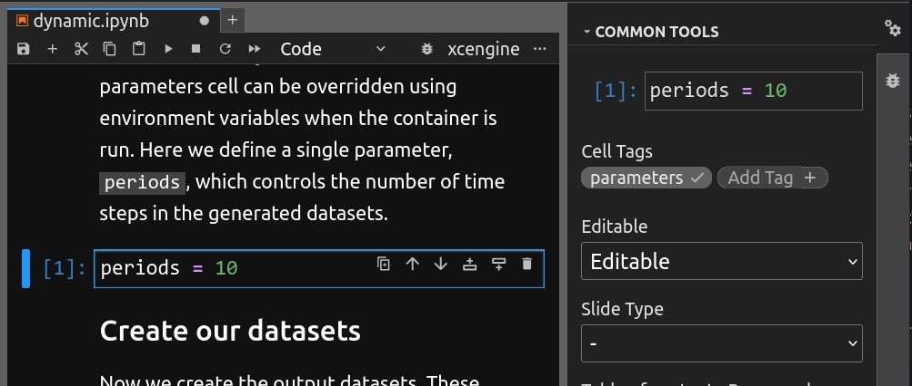

# Making a Jupyter notebook xcengine-compatible

xcengine is designed to require as little alteration as possible to a Python
notebook, but some configuration may be necessary, in particular to define
input parameters.

## Configuring input parameters

An Application Package can have, and usually does have, *input parameters*
defined types and default values, which can be set by the caller when running
the package. xcengine automatically generates these parameters from variables
in the notebook. Any variable to be used as a parameter must be defined
in the **parameters cell** of the notebook. You can only have one parameters
cell in a notebook, and it is strongly advised that the parameters cell appear
**as early as possible** in the notebook.

You turn a normal code cell into a parameters cell by adding a tag called
**parameters** to it in the Jupyter Lab using the Property Inspector.
(The Property Inspector can be opened by clicking the gear icon at the top
right of the Jupyter Lab window.)



You can define as many parameters as you like in the property cell. The
values you assign to them will be used as the default values for these
parameters when xcengine generates the Application Package.

This tagging convention is similar to the one used by [papermill](https://papermill.readthedocs.io/).

## Configuring xcengine

As well as parameters, the parameters cell can contain an **xcengine
configuration dictionary**. This is a Python dictionary with the special
name `xcengine_config`. Available configuration settings are:

-   `workflow_id`: a string identifier for the workflow in your Application
    Package. The runner or Application Package platform can use this
    identifier to refer to you Application Package. By default, the name
    of the notebook (without the `.ipynb` suffix) is used.
-   `environment_file`: the name of a YAML file defining a [conda
    environment](https://docs.conda.io/projects/conda/en/latest/user-guide/tasks/manage-environments.html)
    (these are often called `environment.yml`). If an environment file is not
    specified in the notebook or on the command line, xcetool will try to
    deduce the environment automatically. This cannot be done 100% reliably,
    so it is **strongly recommended** to provide an environment file.
-   `container_image_tag`: the tag applied to the Docker container image that
    xcengine builds. If you plan to push the image to a public registry,
    you can enter the final registry tag here and push the image once it's
    been built by xcengine. If no tag is specified, xcengine will create one
    based on the current date and time.

Some of these configuration settings can also be set on the command line.

## Dataset output

### Selecting datasets for output

No additional code or configuration is needed for datasets to be written from
Application Packages or served when the container image is run in xcube
Server/Viewer mode. xcengine will automatically output or serve any instance
of `xarray.DataSet` which is in scope when the notebook's code has finished
executing. If you're created some datasets which you *don't* wish to be
written, you can use the Python
[`del` statement](https://docs.python.org/3/reference/simple_stmts.html#the-del-statement)
to delete them at the end of the notebook to remove them e.g.

```python
del my_temporary_dataset
```

### Setting dataset output type

By default, all `xarray.DataSet` instances are written as Zarr. But you can
force them to be written as NetCDF by setting an attribute on the dataset,
like this:

```python
my_dataset.attrs["xcengine_output_format"] = "netcdf"
```
