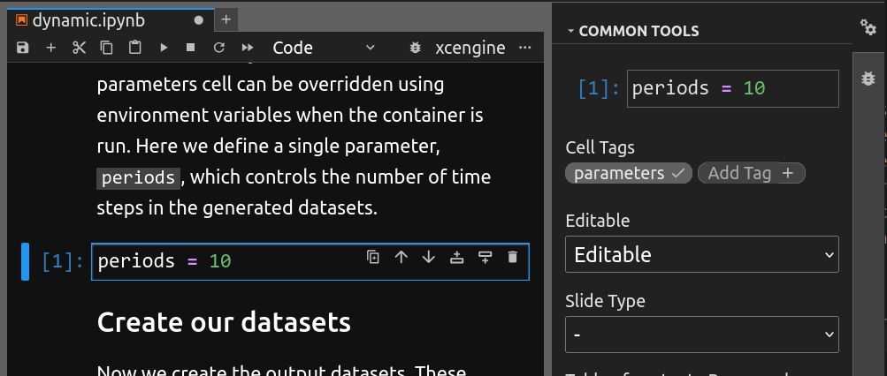

# Making a Jupyter notebook xcengine-compatible

xcengine is designed to require as little alteration as possible to a Python
notebook, but some configuration may be necessary, in particular to define
input parameters.

## Configuring input parameters

An Application Package can have, and usually does have, *input parameters*
defined types and default values, which can be set by the caller when running
the package. xcengine automatically generates these parameters from variables
in the notebook. Any variable to be used as a parameter must be defined
in the **parameters cell** of the notebook. You can only have one parameters
cell in a notebook, and it is strongly advised that the parameters cell appear
**as early as possible** in the notebook.

You turn a normal code cell into a parameters cell by adding a tag called
**parameters** to it in Jupyter Lab using the Property Inspector. (The Property
Inspector can be opened by clicking the gear icon at the top right of the Jupyter
Lab window.)



You can define as many parameters as you like in the property cell. The
values you assign to them will be used as the default values for these
parameters when xcengine generates the Application Package.

This tagging convention is similar to the one used by [papermill](https://papermill.readthedocs.io/).

## Configuring xcengine

As well as parameters, the parameters cell can contain an **xcengine
configuration dictionary**. This is a Python dictionary with the special
name `xcengine_config`. Available configuration settings are:

-   `workflow_id`: a string identifier for the workflow in your Application
    Package. The runner or Application Package platform can use this
    identifier to refer to your Application Package. By default, the name
    of the notebook (without the `.ipynb` suffix) is used.
-   `environment_file`: the name of a YAML file defining a [conda
    environment](https://docs.conda.io/projects/conda/en/latest/user-guide/tasks/manage-environments.html)
    (these are often called `environment.yml`). If an environment file is not
    specified in the notebook or on the command line, xcetool will try to
    deduce the environment automatically. This cannot be done 100% reliably,
    so it is **strongly recommended** to provide an environment file.
-   `container_image_tag`: the tag applied to the Docker container image that
    xcengine builds. If you plan to push the image to a public registry,
    you can enter the final registry tag here and push the image once it's
    been built by xcengine. If no tag is specified, xcengine will create one
    based on the current date and time.

Some of these configuration settings can also be set on the command line.

## Dataset input

As well as the usual methods of dataset input, xcengine provides support for
the Application Package ‘stage-in’ process described in the [OGC Best
Practice document](https://docs.ogc.org/bp/20-089r1.html), in which an
Application Package Platform provides the Application Package with a
[STAC catalogue](https://stacspec.org/) of one or more input datasets.

xcengine currently provides basic support for stage-in: in a generated
Application Package, the xcengine support code provides the notebook code with
the path to the STAC stage-in catalogue. The notebook code can then read this
catalogue (e.g. using [PySTAC](https://pystac.readthedocs.io/)) to find the
staged-in datasets.

An input variable for a STAC stage-in catalogue can be defined in the
parameters cell (see above) as a string variable. The variable name can be
freely chosen, but the variable declaration must be annotated with the string
`"EOInput"` to distinguish it from an ordinary string parameter, like this:

```python
dataset_inputs: "EOInput" = "/some/default/path"
```

When the converted notebook is run as an Application Package, the variable
`dataset_inputs` will be set to a string specifying a filesystem path
containing a STAC catalogue called `catalog.json`, which the notebook code
can use to find staged-in datasets.

## Dataset output

### Selecting datasets for output

No additional code or configuration is needed for datasets to be written
(‘staged out’) from Application Packages or served when the container image is
run in xcube Server/Viewer mode. xcengine will automatically output or serve
any instance of `xarray.DataSet` which is in scope when the notebook's code
has finished executing. If you're created some datasets which you *don't* wish
to be written, you can use the Python [`del`
statement](https://docs.python.org/3/reference/simple_stmts.html#the-del-statement)
to delete them at the end of the notebook to remove them, e.g.

```python
del my_temporary_dataset
```

### Setting dataset output type

By default, all `xarray.DataSet` instances are written as Zarr. But you can
force them to be written as NetCDF by setting an attribute on the dataset,
like this:

```python
my_dataset.attrs["xcengine_output_format"] = "netcdf"
```

## Determining whether your code is running in an xcengine container

In an xcengine-derived container, the environment variable `XCENGINE_VERSION`
is always set to the version of xcengine that created the container image. If
your notebook code needs to determine whether it's running inside an xcengine
container, you can check whether this variable is set (e.g. using
`os.environ`).
